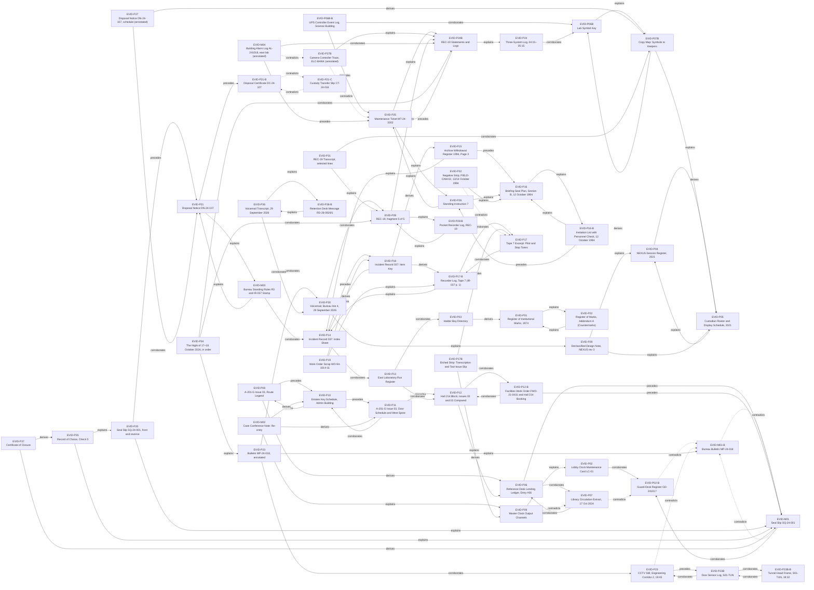

# Evidence graph

_Generated by `case/compile.mjs` from `case/model`. Do not edit by hand._

58 nodes, 104 edges (36 explains, 27 corroborates, 11 contradicts, 14 derives, 16 precedes).

```mermaid
flowchart LR
  EVID_P01["EVID-P01<br/>Register of Institutional Marks, 1974"]
  EVID_P02["EVID-P02<br/>Lobby Clock Maintenance Card LC-01"]
  EVID_P02_B["EVID-P02-B<br/>Guard-Desk Register GD-241017"]
  EVID_P03["EVID-P03<br/>Halder Bay Directory"]
  EVID_P04["EVID-P04<br/>NEXUS Session Register, 2021"]
  EVID_P05["EVID-P05<br/>Custodian Roster and Display Schedule, 2021"]
  EVID_M01["EVID-M01<br/>Seal Slip SQ-24-001"]
  EVID_M01_B["EVID-M01-B<br/>Bureau Bulletin MP-24-018"]
  EVID_P06["EVID-P06<br/>Reference Desk Lending Ledger, Entry #06"]
  EVID_P07["EVID-P07<br/>Library Circulation Extract, 17 Oct 2024"]
  EVID_P08["EVID-P08<br/>A-201-G Issue 03, Route Legend"]
  EVID_P09["EVID-P09<br/>Master Clock Output Channels"]
  EVID_P10["EVID-P10<br/>Estates Key Schedule, Admin Building"]
  EVID_P11["EVID-P11<br/>A-201-G Issue 03, Door Schedule and West Spine"]
  EVID_P12["EVID-P12<br/>Hall 214 Block, Issues 02 and 03 Compared"]
  EVID_P12_B["EVID-P12-B<br/>Facilities Work Order FWO-21-0431 and Hall 214 Booking"]
  EVID_P13["EVID-P13<br/>East Laboratory Run Register"]
  EVID_M02["EVID-M02<br/>Case Conference Note: Re-entry"]
  EVID_P06B["EVID-P06B<br/>Lab Symbol Key"]
  EVID_P06B_B["EVID-P06B-B<br/>UPS Controller Event Log, Science Building"]
  EVID_P07B["EVID-P07B<br/>Copy Map: Symbols to Keepers"]
  EVID_P14["EVID-P14<br/>Incident Record 037: Index Sheet"]
  EVID_P15["EVID-P15<br/>Archive Withdrawal Register 1994, Page 3"]
  EVID_P16["EVID-P16<br/>Briefing Seat Plan, Section B, 12 October 1994"]
  EVID_P16_B["EVID-P16-B<br/>Invitation List with Personnel Check, 12 October 1994"]
  EVID_P17["EVID-P17<br/>Tape 7 Excerpt: Pilot and Stop Tones"]
  EVID_P17_B["EVID-P17-B<br/>Recorder Log, Tape 7 (IR-037 p. 1)"]
  EVID_P17B["EVID-P17B<br/>Etched Strip: Transcription and Tool-Issue Slip"]
  EVID_P18["EVID-P18<br/>Incident Record 037: Item Key"]
  EVID_P19["EVID-P19<br/>Work Order Scrap WO-94-1014-11"]
  EVID_P20["EVID-P20<br/>Seal Slip SQ-24-001, front and reverse"]
  EVID_P21["EVID-P21<br/>Disposal Notice DN-24-107"]
  EVID_P21_B["EVID-P21-B<br/>Disposal Certificate DC-24-107"]
  EVID_P21_C["EVID-P21-C<br/>Custody Transfer Slip CT-24-016"]
  EVID_M03["EVID-M03<br/>Bureau Standing Rules R3 and IR-037 Stamp"]
  EVID_P22["EVID-P22<br/>Register of Marks, Addendum A (Countermarks)"]
  EVID_P23["EVID-P23<br/>CCTV Still, Engineering Corridor 2, 19:45"]
  EVID_P23B["EVID-P23B<br/>Door Sensor Log, S01-TUN"]
  EVID_P23B_B["EVID-P23B-B<br/>Tunnel Head Frame, S01-TUN, 19:32"]
  EVID_P24["EVID-P24<br/>Three-System Log, 04:15–05:15"]
  EVID_P24B["EVID-P24B<br/>REC-19 Statements and Logs"]
  EVID_P25["EVID-P25<br/>Maintenance Ticket MT-24-3302"]
  EVID_P26["EVID-P26<br/>Standing Instruction 7"]
  EVID_P27["EVID-P27<br/>Disposal Notice DN-24-107, schedule (annotated)"]
  EVID_P27B["EVID-P27B<br/>Camera-Controller Trace, ELC-BANK (annotated)"]
  EVID_P28["EVID-P28<br/>REC-19, fragment 5 of 5"]
  EVID_P28_B["EVID-P28-B<br/>Pocket Recorder Log, REC-19"]
  EVID_P29["EVID-P29<br/>Declassified Design Note, NEXUS rev 3"]
  EVID_M04["EVID-M04<br/>Building Alarm Log AL-241018, east lab (annotated)"]
  EVID_P30["EVID-P30<br/>Voicemail, Bureau line 4, 29 September 2026"]
  EVID_P31["EVID-P31<br/>REC-19 Transcript, selected lines"]
  EVID_P32["EVID-P32<br/>Negative Strip, FIELD-CAM-02, 13/14 October 1994"]
  EVID_P33["EVID-P33<br/>Bulletin MP-24-018, annotated"]
  EVID_P34["EVID-P34<br/>The Night of 17–18 October 2024, in order"]
  EVID_P35["EVID-P35<br/>Record of Choice, Check 5"]
  EVID_P36["EVID-P36<br/>Voicemail Transcript, 29 September 2026"]
  EVID_P36_B["EVID-P36-B<br/>Retention Desk Message RD-26-0929/1"]
  EVID_P37["EVID-P37<br/>Certificate of Closure"]
  EVID_P01 -- explains --> EVID_P22
  EVID_P02 -- corroborates --> EVID_P02_B
  EVID_P02_B -. contradicts .-> EVID_M01_B
  EVID_P03 -- derives --> EVID_P01
  EVID_P04 -- explains --> EVID_P05
  EVID_P05 -- explains --> EVID_P04
  EVID_M01 -. contradicts .-> EVID_M01_B
  EVID_M01 -- corroborates --> EVID_P02_B
  EVID_M01_B -. contradicts .-> EVID_M01
  EVID_P06 -- precedes --> EVID_M01
  EVID_P06 -- corroborates --> EVID_P07
  EVID_P07 -- corroborates --> EVID_P06
  EVID_P07 -. contradicts .-> EVID_P02_B
  EVID_P08 -- derives --> EVID_P06
  EVID_P08 -- precedes --> EVID_P10
  EVID_P09 -. contradicts .-> EVID_P07
  EVID_P09 -- explains --> EVID_P02
  EVID_P10 -- derives --> EVID_P08
  EVID_P10 -- precedes --> EVID_P11
  EVID_P11 -- corroborates --> EVID_P10
  EVID_P11 -- precedes --> EVID_P12
  EVID_P12 -- corroborates --> EVID_P12_B
  EVID_P12 -- derives --> EVID_P06
  EVID_P12_B -- corroborates --> EVID_P12
  EVID_P12_B -- precedes --> EVID_M01
  EVID_P13 -- corroborates --> EVID_P03
  EVID_P13 -- corroborates --> EVID_P12
  EVID_M02 -- explains --> EVID_P09
  EVID_M02 -- derives --> EVID_P10
  EVID_M02 -- derives --> EVID_P11
  EVID_P06B -- explains --> EVID_P07B
  EVID_P06B_B -- precedes --> EVID_P25
  EVID_P06B_B -- corroborates --> EVID_P06B
  EVID_P07B -- derives --> EVID_P05
  EVID_P07B -- derives --> EVID_P06B
  EVID_P14 -- corroborates --> EVID_P13
  EVID_P14 -- precedes --> EVID_P18
  EVID_P15 -- explains --> EVID_P14
  EVID_P15 -- precedes --> EVID_P16
  EVID_P16 -- explains --> EVID_P16_B
  EVID_P16_B -- explains --> EVID_P16
  EVID_P16_B -- precedes --> EVID_P26
  EVID_P17 -- corroborates --> EVID_P17_B
  EVID_P17_B -- corroborates --> EVID_P17
  EVID_P17_B -- explains --> EVID_P14
  EVID_P17B -- precedes --> EVID_P17
  EVID_P17B -- explains --> EVID_P09
  EVID_P18 -- derives --> EVID_P14
  EVID_P18 -- derives --> EVID_P15
  EVID_P18 -- derives --> EVID_P17_B
  EVID_P19 -- explains --> EVID_P17_B
  EVID_P19 -- explains --> EVID_P18
  EVID_P20 -- explains --> EVID_M01
  EVID_P20 -- precedes --> EVID_P21
  EVID_P21 -- precedes --> EVID_P21_B
  EVID_P21 -- explains --> EVID_M03
  EVID_P21_B -. contradicts .-> EVID_P21_C
  EVID_P21_C -. contradicts .-> EVID_P21_B
  EVID_M03 -- explains --> EVID_P21
  EVID_M03 -- corroborates --> EVID_P14
  EVID_P22 -- explains --> EVID_P01
  EVID_P23 -. contradicts .-> EVID_M01_B
  EVID_P23 -- precedes --> EVID_P23B
  EVID_P23B -- corroborates --> EVID_P23
  EVID_P23B -- corroborates --> EVID_P23B_B
  EVID_P23B_B -- corroborates --> EVID_P23B
  EVID_P24 -- corroborates --> EVID_P06B
  EVID_P24B -- explains --> EVID_P24
  EVID_P24B -- precedes --> EVID_P25
  EVID_P25 -- explains --> EVID_P24B
  EVID_P25 -- explains --> EVID_P26
  EVID_P26 -- explains --> EVID_P25
  EVID_P26 -- explains --> EVID_P16
  EVID_P27 -- derives --> EVID_P07B
  EVID_P27 -- corroborates --> EVID_P21
  EVID_P27B -. contradicts .-> EVID_P25
  EVID_P27B -- explains --> EVID_P24B
  EVID_P28 -- explains --> EVID_P28_B
  EVID_P28 -- precedes --> EVID_P24B
  EVID_P28_B -- explains --> EVID_P28
  EVID_P29 -- explains --> EVID_P04
  EVID_P29 -- explains --> EVID_P05
  EVID_M04 -. contradicts .-> EVID_P27B
  EVID_M04 -- precedes --> EVID_P25
  EVID_M04 -- corroborates --> EVID_P24B
  EVID_P30 -- corroborates --> EVID_P28
  EVID_P30 -- explains --> EVID_P29
  EVID_P31 -- corroborates --> EVID_P07B
  EVID_P31 -- explains --> EVID_P28
  EVID_P32 -. contradicts .-> EVID_P17
  EVID_P32 -- explains --> EVID_P16
  EVID_P33 -- explains --> EVID_M01_B
  EVID_P33 -- corroborates --> EVID_P23
  EVID_P33 -- corroborates --> EVID_P30
  EVID_P34 -- corroborates --> EVID_P24B
  EVID_P34 -- corroborates --> EVID_P28
  EVID_P34 -- explains --> EVID_P33
  EVID_P35 -- explains --> EVID_M01
  EVID_P35 -- explains --> EVID_P20
  EVID_P36 -- explains --> EVID_P36_B
  EVID_P36 -- corroborates --> EVID_P30
  EVID_P36_B -- explains --> EVID_P36
  EVID_P37 -- derives --> EVID_P35
  EVID_P37 -- derives --> EVID_M01
```
